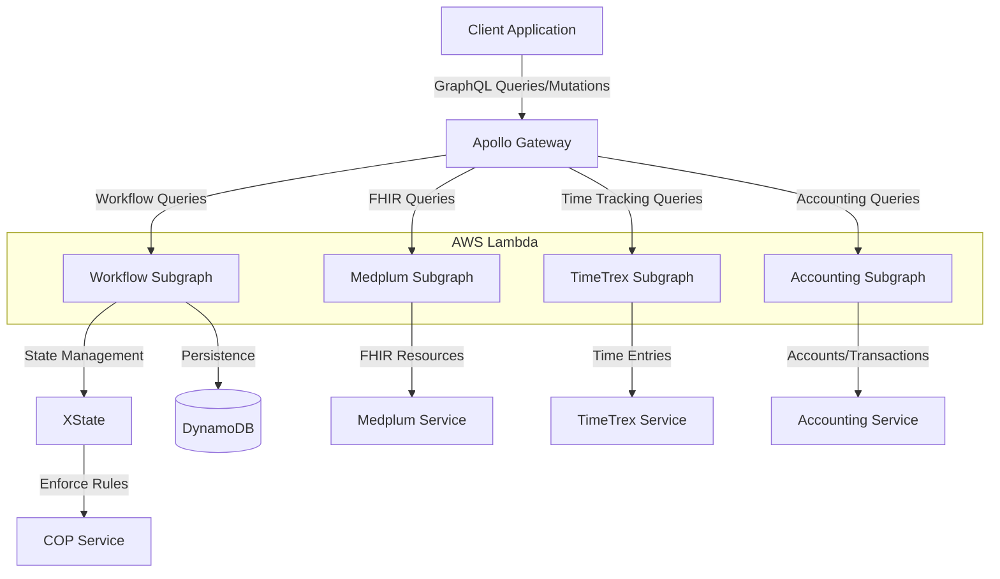

# Workflow Engine with TypeScript, XState, and Clean Architecture

This project implements a robust workflow engine using TypeScript, XState for state management, and follows Clean Architecture principles. It integrates with various services including Medplum for FHIR resources, TimeTrex for time tracking, and a custom accounting system.

## Architecture Overview

The application is built using a modular, microservices-based architecture with the following key components:

1. **Workflow Engine**: Core component managing workflow states and transitions.
2. **GraphQL API**: Provides a unified interface for clients to interact with the system.
3. **Subgraphs**: Specialized services for different domains (Workflow, Medplum, TimeTrex, Accounting).
4. **DynamoDB**: Used for persistent storage of workflow states and other data.
5. **AWS Lambda**: Hosts the individual subgraph services.

## Application Flow

## Key Components

1. **Apollo Gateway**: Acts as the entry point for all client requests, routing them to appropriate subgraphs.

2. **Workflow Subgraph**: 
   - Manages workflow definitions and instances
   - Uses XState for state management
   - Implements COP (Constraint-Oriented Programming) for rule enforcement

3. **Medplum Subgraph**: Handles FHIR resource operations (Patients, Practitioners, Observations)

4. **TimeTrex Subgraph**: Manages time tracking functionalities

5. **Accounting Subgraph**: Handles financial operations (accounts, transactions)

6. **DynamoDB**: Provides persistent storage for workflow states and other application data

7. **XState**: Powers the core workflow engine, managing complex state transitions

8. **COP Service**: Enforces business rules and constraints across the workflow

## Getting Started

1. Clone the repository
2. Install dependencies: `npm install`
3. Set up environment variables (see `.env.example`)
4. Build the project: `npm run build`
5. Start the development server: `npm run dev`

## Deployment

The application is designed to be deployed on AWS Lambda, with each subgraph running as a separate Lambda function. The Apollo Gateway can be deployed as a standalone service or integrated into your client application.

1. Build the Lambda functions: `npm run build:lambda`
2. Deploy the Lambda functions to AWS (use your preferred deployment method or CI/CD pipeline)
3. Set up the Apollo Gateway to use the deployed Lambda function URLs

## Testing

Run the test suite with: `npm test`

## Contributing

Please read CONTRIBUTING.md for details on our code of conduct and the process for submitting pull requests.

## License

This project is licensed under the MIT License - see the LICENSE.md file for details.